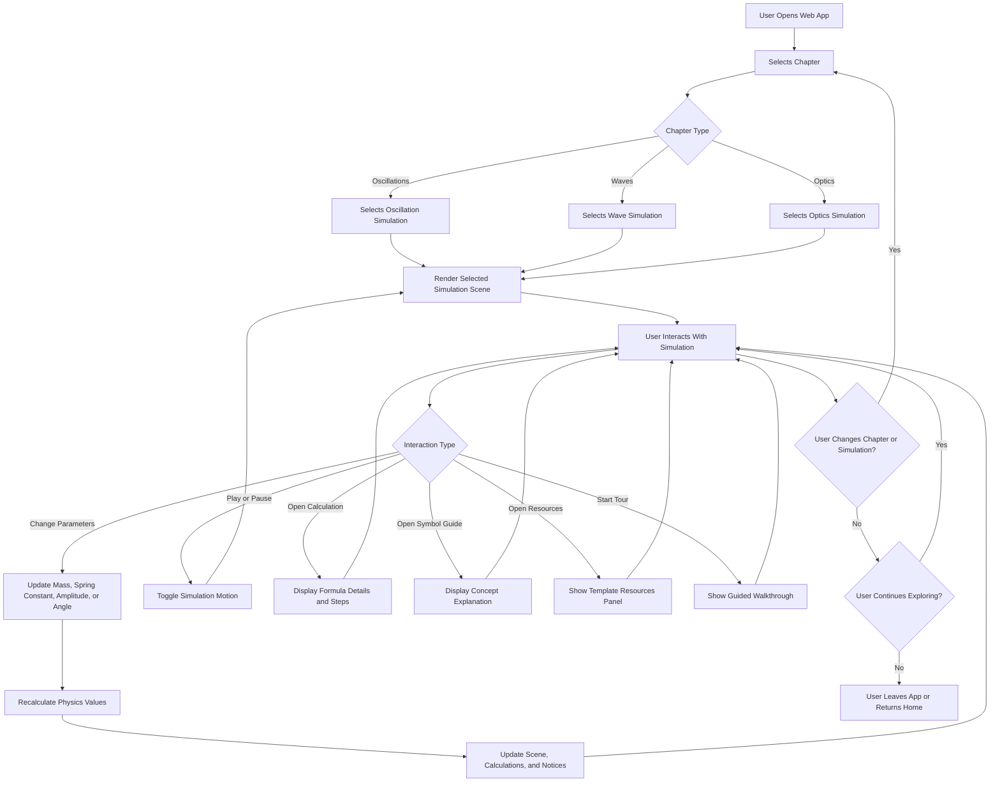
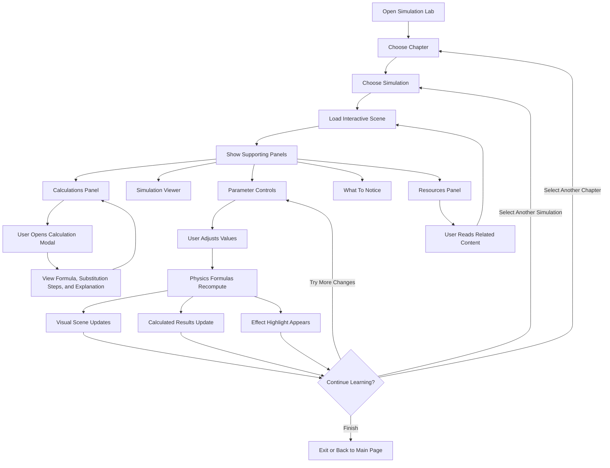
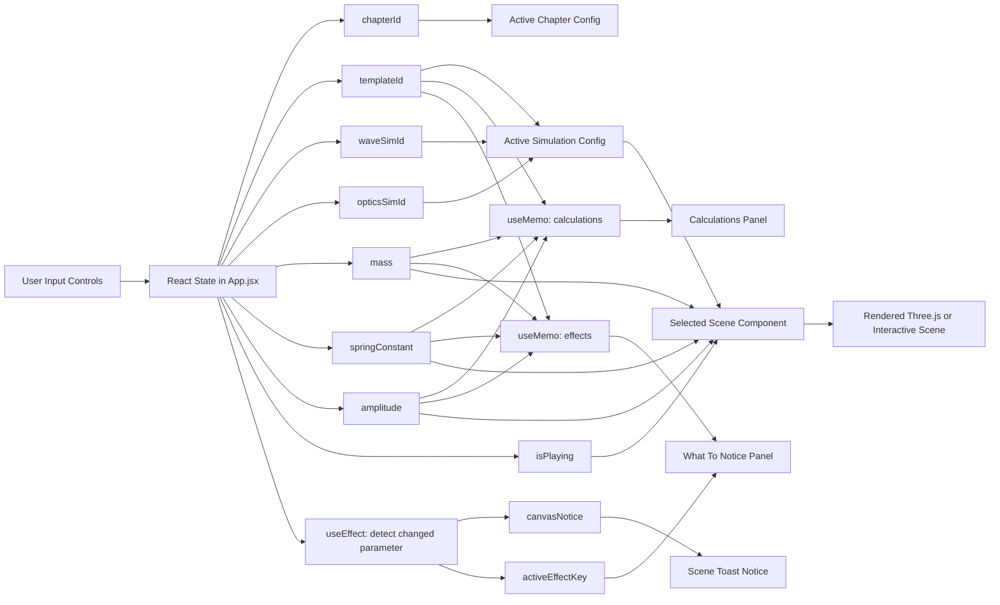
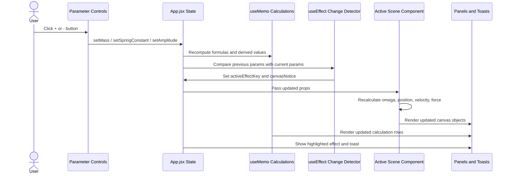
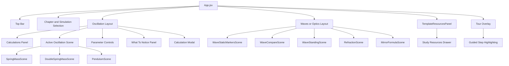

# System Workflow

This workflow gives a high-level view of how a learner moves through the physics simulation app, from opening the web app to exploring simulations, reading calculations, and using resources.



## Workflow Notes

- The user first chooses a chapter: Oscillations, Waves, or Optics.
- Each chapter has its own simulation options.
- The selected simulation renders in the main scene area.
- For oscillation simulations, the user can adjust parameters and see formulas, values, explanations, and the scene update together.
- The resources panel provides supporting learning material for the selected chapter and simulation.
- The guided tour helps new users understand the main areas of the interface.
- The user can keep switching chapters and simulations without restarting the app.

## App-Specific Flow



## Technical Architecture

This section explains what happens inside the app when the user changes values and the simulation updates.

### React State and Derived Data Flow



### Parameter Change Sequence



### Simulation Render Loop

The oscillation scene components create a Three.js scene once, then update object positions during animation. When React props change, the scene effect runs with the latest values.

```mermaid
flowchart TD
    A[Scene Component Receives Props] --> B[Create Three.js Scene]
    B --> C[Create Camera, Lights, Floor, Labels, Arrows, Meshes]
    C --> D[Calculate Physics Constants]

    D --> D1[omega = sqrt(k / m)]
    D --> D2[position = equilibrium + A * sin(theta)]
    D --> D3[velocity = A * omega * cos(theta)]
    D --> D4[force = -k * displacement]

    D --> E{isPlaying?}
    E -->|Yes| F[Advance theta using delta time]
    E -->|No| G[Keep current phase]

    F --> H[Update Mesh Positions]
    G --> H

    H --> I[Update Spring Scale and Anchors]
    I --> J[Update Velocity and Force Arrows]
    J --> K[Update Labels and Checkpoint Text]
    K --> L[renderer.render scene camera]
    L --> E

    A --> M{Props Changed?}
    M -->|mass, k, amplitude, or play state changed| N[Cleanup old scene resources]
    N --> B
```

### Oscillation Formula Pipeline

```mermaid
flowchart TD
    A[Current Input Values] --> B[Clamp to Safe Values]
    B --> C{Selected Oscillation Template}

    C -->|Single Spring-Mass| D[k_eff = k]
    C -->|Double Spring-Mass| E[k_eff = 2k]
    C -->|Simple Pendulum| F[Use length and gravity model]

    D --> G[omega = sqrt(k_eff / m)]
    E --> G
    G --> H[T = 2 * pi * sqrt m / k_eff]
    G --> I[v_max = omega * A]
    G --> J[a_max = omega^2 * A]
    D --> K[Energy = 1/2 * k_eff * A^2]
    E --> K

    F --> L[theta_0 from amplitude control]
    L --> M[omega = sqrt(g / L)]
    M --> N[T = 2 * pi * sqrt L / g]
    M --> O[v_max = theta_0 * omega * L]
    M --> P[Energy approximation from angular motion]

    H --> Q[Calculation Rows]
    I --> Q
    J --> Q
    K --> Q
    N --> Q
    O --> Q
    P --> Q

    Q --> R[Calculation Panel]
    Q --> S[Calculation Detail Modal]
```

### Component Responsibility Map



### Data Ownership Summary

| Area | Owner | Purpose |
| --- | --- | --- |
| Chapter selection | `App.jsx` | Decides which chapter view is active. |
| Simulation selection | `App.jsx` | Decides which scene component should render. |
| Physics inputs | `App.jsx` | Stores values such as mass, spring constant, amplitude, and play state. |
| Calculated values | `useMemo` in `App.jsx` | Recomputes formula rows whenever inputs change. |
| Effect messages | `useMemo` and `useEffect` in `App.jsx` | Highlights what changed and displays notices. |
| 3D object motion | Scene components | Uses current props to update meshes, springs, arrows, and labels. |
| Resources panel | `TemplateResourcesPanel.jsx` | Opens and closes the study resources drawer. |
